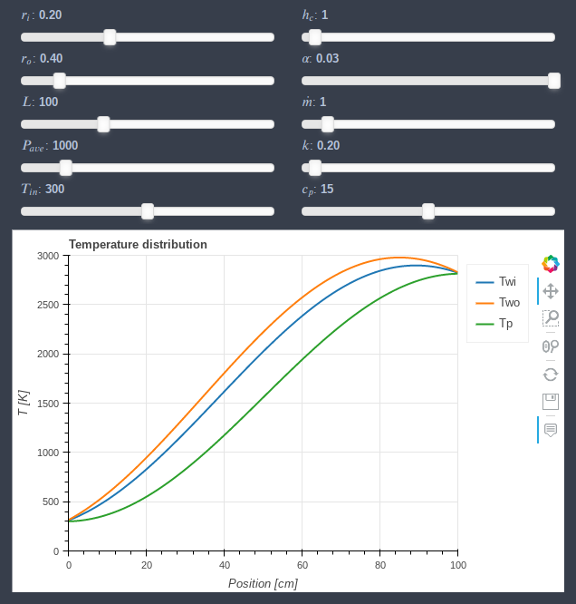
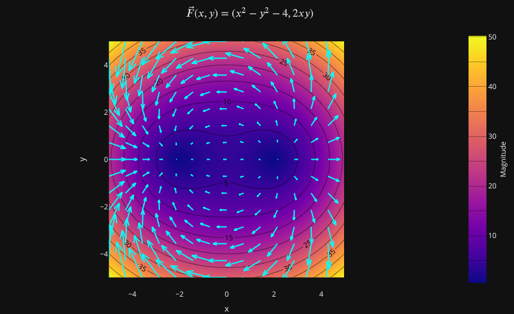
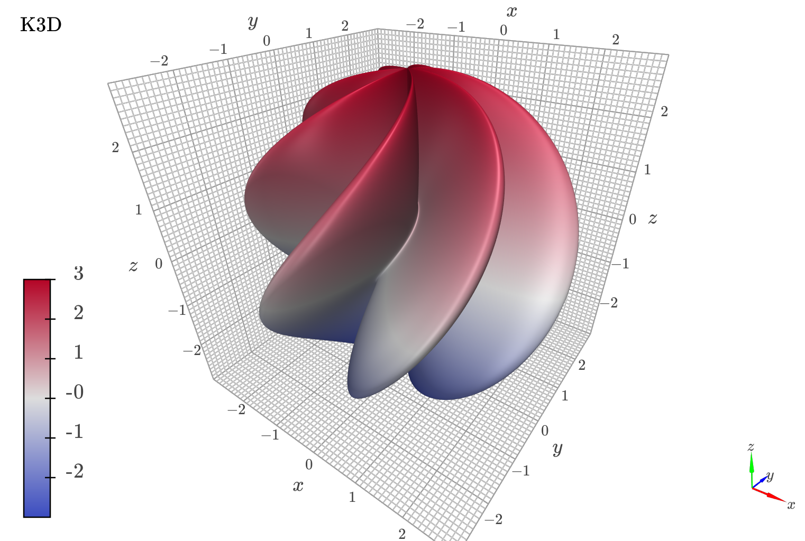
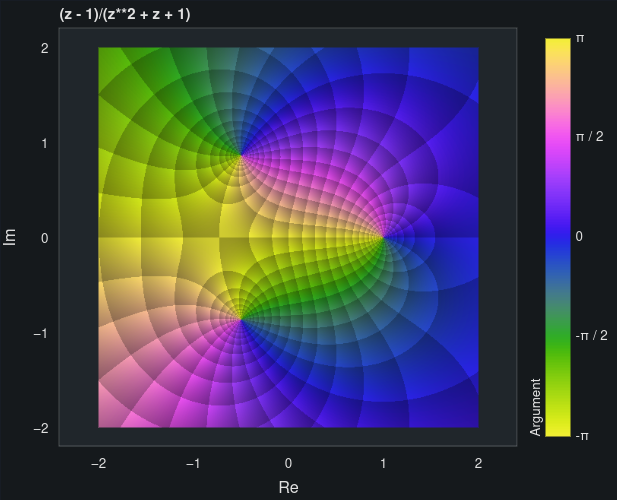
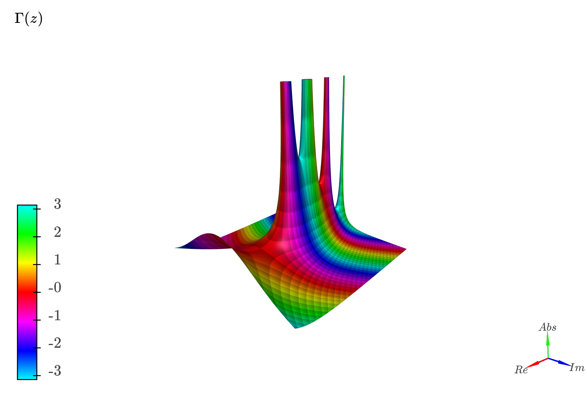
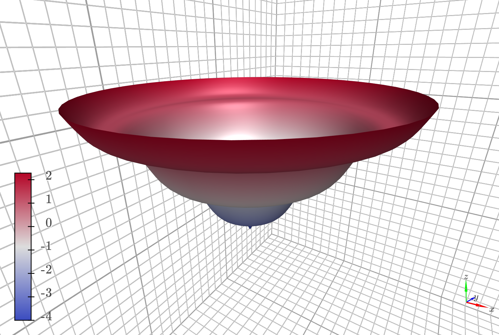

# Sympy Plotting Backends

[](https://mybinder.org/v2/gh/Davide-sd/sympy-plot-backends/HEAD)

This module contains a few plotting backends that can be used with [SymPy](github.com/sympy/sympy) as an alternative to the default Matplotlib backend. A backend represents the plotting library: it provides the necessary functionalities to quickly and easily plot the most common types of symbolic expressions (line plots, surface plots, parametric plots).

<div>






</div>


## What's new in comparison to SymPy

On top of the usual plotting functions exposed by SymPy (`plot`, `plot_parametric`, `plot3d`, etc.), this module offers:
* capability to use a different backend.
* `vector_plot` function to quickly visualize 2D/3D vector fields.
* `complex_plot` function to quickly visualize 2D/3D complex functions. In particular, we can visualize the real and imaginary parts, the modulus and argument, 2D/3D domain coloring.
* `iplot` function to create parametric-interactive plots using widgets (sliders, buttons, etc.).
* `get_plot_data` function to easily extract the numerical data from symbolic expressions, which can later be used to create custom plots with our plotting library of choice.
* `plotgrid` function, which replaces the `PlotGrid` class: it allows to combine multiple plots into a grid-like layout. It works with Matplotlib, Bokeh and Plotly.


## Backends

The 2 most important reasons for using a different backend are:
1. **Better interactive** experience (explored in the tutorial notebooks).
2. To use the **plotting library we are most comfortable with**. The backend can be used as a starting point to plot symbolic expressions; then, we could use the figure object to add numerical (or experimental) results using the commands associated to the specific plotting library.

The following plotting libraries are supported: [Matplolib](https://matplotlib.org/), [Plotly](https://plotly.com/), [Bokeh](https://github.com/bokeh/bokeh), [K3D-Jupyter](https://github.com/K3D-tools/K3D-jupyter)

Each backend has its own advantages and disadvantages, as we can see from the following table:

|                        | Matplolib | Bokeh | Plotly |  K3D |
|:----------------------:|:---------:|:-----:|:------:|:----:|
|           2D           |     Y     |   Y   |    Y   |   N  |
|           3D           |     Y     |   N   |    Y   |   Y  |
|    Vector Plots 2D     |     Y     |   Y   |    Y   |   N  |
|    Vector Plots 3D     |     Y     |   N   |    Y   |   Y  |
|   Complex Plots 2D     |     Y     |   Y   |    Y   |   N  |
|   Complex Plots 3D     |     Y     |   N   |    Y   |   Y  |
|        Implicit        |     Y     |   Y   |    Y   |   N  |
|      Latex Support     |     Y     |   N   |    Y   |   Y  |
|      Save Picture      |     Y     |   Y   |    Y   |   Y  |
|       Jupyter NB       |     Y     |   Y   |    Y   |   Y  |
|   Python Interpreter   |     Y     |   Y   |    Y   |   N  |
| Parametric-Interactive |     Y     |   Y   |    Y   |   Y  |

In particular:

* Matplotlib (default with SymPy) is a good general backend supporting all kinds of plots, but it is very slow at rendering 3D plots and it lacks interactivity (even with [ipympl](https://github.com/matplotlib/ipympl), interactivity falls behind in comparison to other plotting libraries).
* Plotly is another general backend supporting many kinds of plot. Interactivity and data exploration are great, however it does have a few limitations:
  * Slower rendering than all other backends because it adds HTML elements to the DOM of the notebook.
  * Lack of gradient lines.
  * Generally inferior when plotting implicit expression in comparison to Matplotlib. Also, it can be really slow when plotting multiple implicit expressions simultaneously.
  * No wireframe support for 3D plots, which could lead to difficult to understand plots.
* Bokeh: interactivity and data exploration are great. It supports auto-update while panning the plot (only works with lines), however:
  * Generally inferior when plotting implicit expression in comparison to Matplotlib.
  * Lack of contour plot.
* K3D only supports 3D plots but, compared to Matplotlib, it offers amazing 3D performance: we can increase significantly the number of discretization points obtaining smoother plots. It can only be used with Jupyter Notebook, whereas the other backends can also be used with IPython or a simple Python interpreter. This backends use an aspect ratio of 1 on all axis: they don't scale the visualization. What you see is the object as you would see it in reality.
* **Parametric-Interactive**: thanks to [holovis'z panel](https://github.com/holoviz/panel), we can use widgets (sliders, buttons, ...) to visually explore the symbolic expression.

The following table shows the common keyword arguments implemented in SymPy's `Plot` class, which is the parent class for all backends. Because each plotting library is unique, some of these options may not be supported by a specific backend (or have not been implemented yet):

|  keyword arg  | Matplolib | Bokeh | Plotly | K3D |
|:-------------:|:---------:|:-----:|:------:|:---:|
|     xlim      |     Y     |   Y   |    Y   |  N  |
|     ylim      |     Y     |   Y   |    Y   |  N  |
|     zlim      |     Y     |   N   |    Y   |  N  |
|    xscale     |     Y     |   Y   |    Y   |  N  |
|    yscale     |     Y     |   Y   |    Y   |  N  |
|    zscale     |     Y     |   N   |    Y   |  N  |
|     grid      |     Y     |   Y   |    Y   |  Y  |
|  axis_center  |     Y     |   N   |    N   |  N  |
|    aspect     |     Y     |   Y   |    Y   |  N  |
|     size      |     Y     |   Y   |    Y   |  Y  |
|     title     |     Y     |   Y   |    Y   |  Y  |
|    xlabel     |     Y     |   Y   |    Y   |  Y  |
|    ylabel     |     Y     |   Y   |    Y   |  Y  |
|    zlabel     |     Y     |   N   |    Y   |  Y  |

For example, while SymPy's default backend (Matplotlib) is implemented to mimic hand-plotted 2D charts, that is the horizontal and vertical axis are not necessarely fixed to the bottom-side and left-side of the plot respectively (we can specify their location with `axis_center`), I didn't implement this feature on Bokeh and Plotly because it doesn't add any value to my personal use. If you find that some options could be implemented, please consider contributing with a PR.

Please, read the docstring associated to each backend to find out more options and what they do.


## Warnings

While this module is based on `sympy.plotting`, there are some differences (structural and usability) that make them incompatible. Interchanging between these two modules might lead to some errors! I suggest to use this module instead of `sympy.plotting`. On the usability side, the main differences are:
1. `label` keyword argument has been removed.
2. `nb_of_points_*` keyword arguments have been replaced by `n` or `n1, n2`.
3. `ImplicitSeries` now uses mesh grid algorithm and contour plots by default. It is going to automatically switch to an adaptive algorithm if Boolean expressions are found.

Currently, this module must be considered in beta phase. If you find any bug, please open an issue. If you feel like some feature could be implemented, open an issue or create a PR.

Finally, **some backend comes with a memory cost**. Since they require external libraries and/or open a server-process in order to visualize the data, memory usage can quickly rise if we are showing many plots. Keep an eye on you system monitor and act accordingly (close the kernels, restart the browser, etc.). 


## Known Bugs

To implement this module, a great effort went into the integration of several libraries and maintaining a consistent user experience with the different backends.

However, there are a few known bugs inherited from dependency-libraries that we should be aware of:

* As a design choice, I decided to include `iplot` when importing everything (`from spb import *`), which uses [holovis'z panel](https://github.com/holoviz/panel). However, this brings out a bug: once we decide to use `BokehBackend`, we can't go back to other backends (the plots won't be visible in the output cell). The only way to be fix this problem is to close Jupyter server and start again.
* The aforementioned bug also manifests itself while using `plotgrid` with different types of plots (`PlotlyBackend, BokehBackend`, etc.).


## Installation

Click the _launch binder_ icon below to interactively explore the notebooks in the tutorial folder.


1. Download this repository: `git clone https://github.com/Davide-sd/sympy-plot-backends`
2. Move into the module folder, `sympy_plot_backends` and install the module with the command `pip install -e .`.
    * Note that we installed it in _editable_ mode. This will allows us to customize it and try different default options.
    * At the moment Mayavi won't be automatically installed. [You need to do that youself by following these steps](https://github.com/enthought/mayavi#installation).
3. Launch Jupyter Notebook and explore the `tutorials` folder to see what this module offers. Alternatively, click the following button to explore it online (in this case Mayavi won't work, therefore comment out the lines of code referring to Mayavi!). [](https://mybinder.org/v2/gh/Davide-sd/sympy-plot-backends/HEAD)
4. **Optional step**: open the file `spb/defaults.py` and change the default backends and related options. [Tutorial 3](tutorials/tutorial-3.customize-the-module.ipynb) helps you with that.


## Usage

```
from sympy import *
from spb import plot3d_parametric_surface as p3ds
var("u, v")

p3ds(v * cos(u), v * sin(u), v + sin(3 * v) / 3 - 4, (u, 0, 2 * pi), (v, 0, 2 * pi))
```
<div align="center">

</div>

Look at the notebooks in the [tutorials](\tutorials) folder to fully understand what this module offers.
