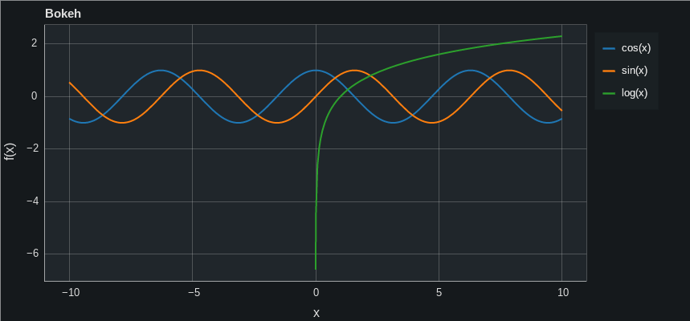
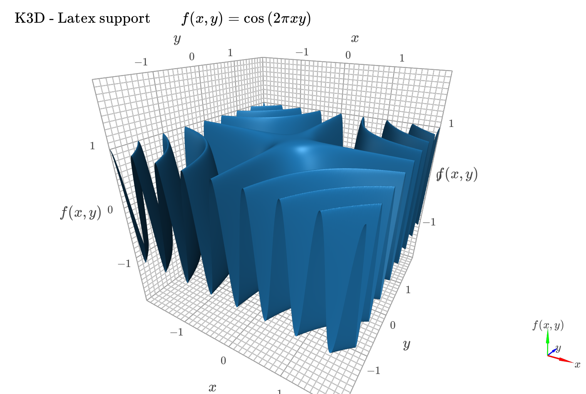
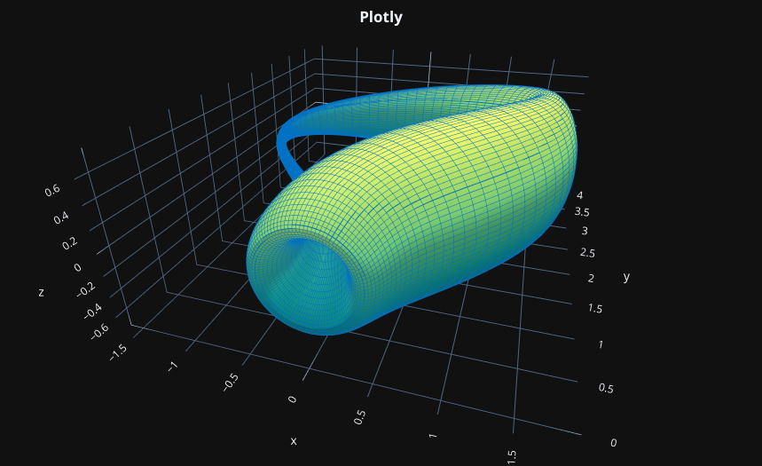
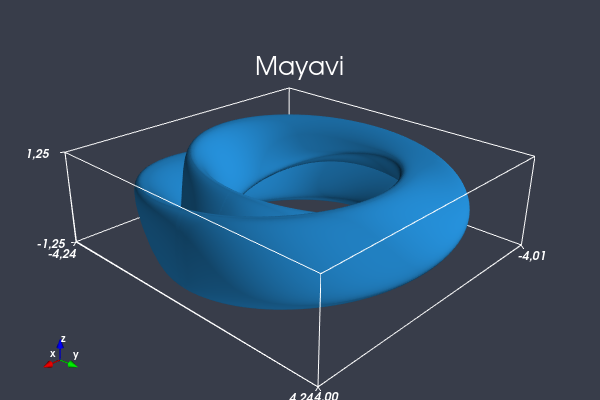

# Sympy Plotting Backends

This module contains a few backends that can be used with [SymPy](github.com/sympy/sympy) as an alternative to the default Matplotlib backend. A backend represents the plotting library being used: it provides the necessary functionalities for quickly and easily plot the most common types of symbolic expressions (line plots, surface plots, parametric plots).

<div>






</div>

The two most important reasons for using a different backend are:
1. **Better interactive** experience (explored in the tutorial notebooks).
2. To use the **plotting library we are most comfortable with**. The backend can be used as a starting point to plot symbolic expressions; then, we could use the figure object to add numerical (or experimental) results using the commands associated to the specific plotting library.

The following plotting libraries are supported: [Plotly](https://plotly.com/), [Bokeh](https://github.com/bokeh/bokeh), [Mayavi](https://github.com/enthought/mayavi), [K3D-Jupyter](https://github.com/K3D-tools/K3D-jupyter)

Each backend has its own advantages and disadvantages, as we can see from the following table:

|               | Matplolib | Bokeh | Plotly | Mayavi | K3D |
|:-------------:|:---------:|:-----:|:------:|:------:|:---:|
|       2D      |     Y     |   Y   |    Y   |    N   |  N  |
|       3D      |     Y     |   N   |    Y   |    Y   |  Y  |
|   Implicit    |     Y     |   N   |    Y   |    N   |  N  |
|   PlotGrid    |     Y     |   N   |    N   |    N   |  N  |
| Latex Support |     Y     |   N   |    Y   |    N   |  Y  |
| Save Picture  |     Y     |   Y   |    Y   |    Y   |  Y  |
|  Jupyter NB   |     Y     |   Y   |    Y   |    Y   |  Y  |
| Python Interp |     Y     |   Y   |    Y   |    Y   |  N  |

In particular:
* Matplotlib (default with SymPy) is good but it lacks interactivity (of course, we can use [ipympl](https://github.com/matplotlib/ipympl) but the overall interactive experience is still behind in comparison to the other backends).
* Matplotlib and Plotly are the two most general backend, both supporting 2D and 3D plots.
* Mayavi and K3D only supports 3D plots but, compared to Matplotlib,they are blazingly fast in the user-interaction. Hence, we can increase significantly the number of discretization points obtaining smoother plots. Note that these backends use an aspect ratio of 1 on all axis, meaning that they don't scale the visualization. What you see is the object as you would see it in reality.
* K3D can only be used with Jupyter Notebook, whereas the other backends can also be used with IPython or a simple Python interpreter.
* Plotly and Bokeh require external libraries in order to export plots to png or svg. Read the docstrings of the respective classes to understand what you need to install.

The following table shows the common keyword arguments implemented in SymPy's `Plot` class, which is the parent class for all backends. Because each plotting library is unique, some of these options may not be supported by a specific backend (or have not been implemented yet):

|  keyword arg  | Matplolib | Bokeh | Plotly | Mayavi | K3D |
|:-------------:|:---------:|:-----:|:------:|:------:|:---:|
|     xlim      |     Y     |   Y   |    Y   |    N   |  N  |
|     ylim      |     Y     |   Y   |    Y   |    N   |  N  |
|     zlim      |     Y     |   N   |    Y   |    N   |  N  |
|    xscale     |     Y     |   Y   |    Y   |    N   |  N  |
|    yscale     |     Y     |   Y   |    Y   |    N   |  N  |
|    zscale     |     Y     |   N   |    Y   |    N   |  N  |
|     axis      |     Y     |   Y   |    Y   |    Y   |  Y  |
|  axis_center  |     Y     |   N   |    N   |    N   |  N  |
| aspect_ratio  |     Y     |   N   |    Y   |    N   |  N  |
|   autoscale   |     Y     |   N   |    N   |    N   |  N  |
|    margin     |     Y     |   N   |    N   |    N   |  N  |
|     size      |     Y     |   Y   |    Y   |    Y   |  Y  |
|     title     |     Y     |   Y   |    Y   |    Y   |  Y  |
|    xlabel     |     Y     |   Y   |    Y   |    Y   |  Y  |
|    ylabel     |     Y     |   Y   |    Y   |    Y   |  Y  |
|    zlabel     |     Y     |   N   |    Y   |    Y   |  Y  |

For example, while SymPy's default backend (Matplotlib) is implemented to mimic hand-plotted 2D charts, that is the horizontal and vertical axis are not necessarely fixed to the bottom-side and left-side of the plot respectively (we can specify their location with `axis_center`), I didn't implement this feature on Bokeh and Plotly because it doesn't add any value to my personal use. If you find that some options could be implemented, please consider contributing with a PR.

Other options are only available to a specific backend, for example:

|  keyword arg  | Matplolib | Bokeh | Plotly | Mayavi | K3D |
|:-------------:|:---------:|:-----:|:------:|:------:|:---:|
|  line_color   |     Y     |   N   |    N   |    N   |  N  |
| surface_color |     Y     |   N   |    N   |    N   |  N  |
|     theme     |     N     |   Y   |    Y   |    N   |  N  |
|   wireframe   |     N     |   N   |    Y   |    Y   |  Y  |
|   bg_color    |     N     |   N   |    N   |    Y   |  Y  |
|   fg_color    |     N     |   N   |    N   |    Y   |  N  |
|  grid_color   |     N     |   N   |    N   |    N   |  Y  |
|    use_cm     |     N     |   N   |    Y   |    Y   |  Y  |
|   show_label  |     N     |   N   |    N   |    N   |  Y  |

Please, read the docstring associated to each backend to find out what they do.

Finally, **some backend comes with a memory cost**. Since they require external libraries and/or open a server-process in order to visualize the data, memory usage can quickly rise if we are showing many plots. Keep an eye on you system monitor and act accordingly (close the kernels, restart the browser, etc.). 

## Requirements

The following list of requirements will automatically be downloaded once you install the module:

`numpy, sympy>=1.9, matplotlib, plotly>=4.14.3, bokeh, PyQt5, mayavi, k3d`

## Installation

1. Download this repository: `git clone `
2. Move into the module folder, `sympy_plot_backends`.
3. Explore the notebooks contained in the `tutorials` folder to see what the backends do.
4. **Optional step**: open the file `spb/functions.py` and change the default backends. [Tutorial 3](tutorials/tutorial-3.set-default-backend.ipynb) helps you with that.
5. **Optional step**: you may want to change default values of backend-specific options to better integrate the plots with your Jupyter theme. For example, currently Bokeh and Plotly's `theme` are set to dark themes. Mayavi and k3D `bg_color` are set to dark. [Tutorial 4](tutorials/tutorial-4.customizing-backends-before-installation.ipynb) helps you with that.
6. Run the installer: `pip install .`

## Usage

```
from sympy import *
from spb import plot3d_parametric_surface as p3ds
var("u, v")

p3ds(v * cos(u), v * sin(u), v + sin(3 * v) / 3 - 4, (u, 0, 2 * pi), (v, 0, 2 * pi))
```
<div align="center">

</div>

Look at the notebooks in the [tutorials](\tutorials) folder to better understand the pros and cons of each backend.
