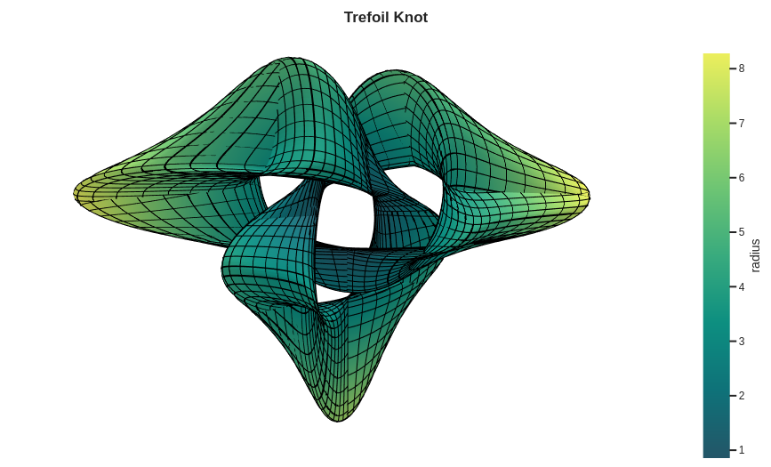

.. Sympy Plotting Backends documentation master file, created by
   sphinx-quickstart on Fri Jul 30 21:36:12 2021.
   You can adapt this file completely to your liking, but it should at least
   contain the root `toctree` directive.

Welcome to Sympy Plotting Backends's documentation!
===================================================

This Python module contains a few plotting backends that can be used with
`SymPy <http://github.com/sympy/sympy/>`_ and `Numpy <https://github.com/numpy/numpy>`_.
A backend represents the plotting library:
it provides the necessary functionalities to quickly and easily plot the most
common types of symbolic expressions (line plots, surface plots,
parametric plots, vector plots, complex plots, control system plots).

Most of the plotting functions can also automatically generates widgets
(sliders, buttons, ...) starting from symbolic expressions. It allows to
better understand the influence of each parameters in a particular expression,
without the knowledge of complicated widget libraries.

.. image:: _static/iplot_bokeh.png
  :width: 220
  :alt: interactive plot with bokeh

.. image:: _static/bokeh_domain_coloring.png
  :width: 220
  :alt: domain coloring

Development and Support
=======================

If you feel like a feature could be implemented, open an issue or create a PR.

If you really want a new feature but you don't have the capabilities or the
time to make it work, I'm willing to help; but first, open an issue or send
me an email so that we can discuss a sponsorship strategy.

Developing this module and its documentation was no easy job. Implementing
new features and fixing bugs requires time and energy too. If you found this
module useful and would like to show your appreciation, please consider
sponsoring this project with either one of these options:

.. button-link:: https://www.buymeacoffee.com/davide_sd
    :color: primary

    :fas:`mug-hot;fa-xl` Buy me a Coffee

.. button-link:: https://github.com/sponsors/Davide-sd
    :color: primary

    :fab:`github;fa-xl` Github Sponsor :fas:`heart;fa-xl`

.. toctree::
   :maxdepth: 1
   :caption: Contents:

   overview.rst
   install.rst
   modules/index.rst
   tutorials/index.rst
   changelog.rst

Indices and tables
==================

* :ref:`genindex`
* :ref:`modindex`
* :ref:`search`
