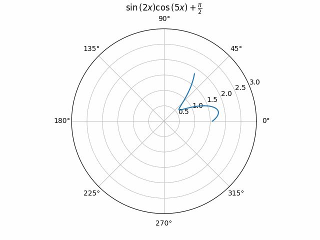

=========
 Overview
=========

The following overview briefly introduce the functionalities exposed by this
module.

Plotting functions
==================

On top of the usual and limited SymPy plotting functions, many new functions
are implemented to deal with 2D or 3D lines, contours, surfaces, vectors,
complex functions and control theory. The output of all of them can be viewed
by exploring the :doc:`Modules </modules/index>` section.

Backends
========

This module allows the user to chose between 5 different backends (plotting
libraries):
`Matplotlib <https://matplotlib.org/>`_,
`Plotly <https://plotly.com/>`_,
`Bokeh <https://github.com/bokeh/bokeh>`_,
`K3D-Jupyter <https://github.com/K3D-tools/K3D-jupyter>`_.

The 3 most important reasons for supporting multiple backends are:

#. **In the Python ecosystem there is no perfect plotting library**. Each one
   is great at something and terrible at something else. Supporting multiple
   backends allows the plotting module to have a greater capability of
   visualizing different kinds of symbolic expressions.

#. **Better interactive** experience (explored in the tutorial section), which
   translates to better data exploration and visualization (especially when
   working with Jupyter Notebook).

#. To use the **plotting library we are most comfortable with**.

More information about the backends can be found at:
:doc:`Backends </modules/backends/index>` .

Examples
========

The following code blocks shows a few examples about the capabilities of
this module. Please, try them on a Jupyter Notebook to explore the interactive
figures.

Interactive-Parametric 2D plot of the magnitude of a second order transfer
function:

.. panel-screenshot::

   from sympy import symbols, log, sqrt, re, im, I
   from spb import plot, BB
   from bokeh.models.formatters import PrintfTickFormatter
   formatter = PrintfTickFormatter(format="%.3f")
   kp, t, z, o = symbols("k_P, tau, zeta, omega")
   G = kp / (I**2 * t**2 * o**2 + 2 * z * t * o * I + 1)
   mod = lambda x: 20 * log(sqrt(re(x)**2 + im(x)**2), 10)
   plot(
       (mod(G.subs(z, 0)), (o, 0.1, 100), "G(z=0)", {"line_dash": "dotted"}),
       (mod(G.subs(z, 1)), (o, 0.1, 100), "G(z=1)", {"line_dash": "dotted"}),
       (mod(G), (o, 0.1, 100), "G"),
       params = {
           kp: (1, 0, 3),
           t: (1, 0, 3),
           z: (0.2, 0, 1, 200, formatter, "z")
       },
       backend = BB,
       n = 2000,
       xscale = "log",
       xlabel = "Frequency, omega, [rad/s]",
       ylabel = "Magnitude [dB]",
       use_latex = False,
       update_event=True
   )

Polar animation with Matplotlib:

.. code-block::

   from sympy import symbols, sin, cos, pi, latex
   from spb import plot_polar, prange
   u, x = symbols("u, x")
   expr = sin(2 * x) * cos(5 * x) + pi / 2
   plot_polar(
       expr, prange(x, 0, u),
       params={u: (1, 2*pi)}, animation={"fps": 10, "time": 4},
       polar_axis=True, ylim=(0, 3), title="$%s$" % latex(expr))

2D parametric plot with Matplotlib, using Numpy and lambda functions:

.. plot::
   :context: reset
   :include-source: True

   import numpy as np
   from spb import plot_parametric
   plot_parametric(
      lambda t: np.sin(3 * t + np.pi / 4), lambda t: np.sin(4 * t),
      ("t", 0, 2 * np.pi), "t [rad]", xlabel="x", ylabel="y", aspect="equal")

Interactive-Parametric domain coloring plot of a complex function:

.. panel-screenshot::
   :small-size: 800, 625

   from sympy import symbols, latex
   from spb import *
   import colorcet
   u, v, w, z = symbols("u, v, w, z")
   expr = (z - 1) / (u * z**2 + v * z + w * 1)
   params = {
      u: (1, 1e-5, 2),
      v: (1, 0, 2),
      w: (1, 0, 2),
   }
   graphics(
      domain_coloring(
         expr, (z, -2-2j, 2+2j), coloring="m", cmap=colorcet.CET_C7,
         n=500, params=params),
      use_latex=False, title="$%s$" % latex(expr), grid=False,
      update_event=True
   )

Animation of a 3D surface using K3D-Jupyter. Here we create an
``Animation`` object, which can later be used to save the animation
to a file.

.. code-block::

   from sympy import *
   from spb import *
   import numpy as np
   r, theta, t, a = symbols("r, theta, t, a")
   expr = cos(r**2 - a) * exp(-r / 3)
   plot3d_revolution(
      expr, (r, 0, 5), (theta, 0, t),
      params={t: (1e-03, 2*pi), a: (0, 2*pi)},
      use_cm=True, color_func=lambda x, y, z: np.sqrt(x**2 + y**2),
      is_polar=True,
      wireframe=True, wf_n1=30, wf_n2=30,
      wf_rendering_kw={"width": 0.005},
      animation=True,
      title=(r"theta={:.4f}; \, a={:.4f}", t, a),
      backend=KB, grid=False
   )

.. video:: _static/animations/3d_animation.mp4
   :width: 500

3D plot with Plotly of a parametric surface, colored according to the
radius, with wireframe lines (also known as grid lines) highlighting the
parameterization:

.. plotly::
   :camera: 1.75, 0, 0, 0, 0, 0, 0, 0, 1

   from sympy import symbols, cos, sin, pi
   from spb import plot3d_parametric_surface, PB
   import numpy as np
   u, v = symbols("u, v")
   def trefoil(u, v, r):
       x = r * sin(3 * u) / (2 + cos(v))
       y = r * (sin(u) + 2 * sin(2 * u)) / (2 + cos(v + pi * 2 / 3))
       z = r / 2 * (cos(u) - 2 * cos(2 * u)) * (2 + cos(v)) * (2 + cos(v + pi * 2 / 3)) / 4
       return x, y, z
   plot3d_parametric_surface(
      trefoil(u, v, 3), (u, -pi, 3*pi), (v, -pi, 3*pi), "radius",
      grid=False, title="Trefoil Knot", backend=PB, use_cm=True,
      color_func=lambda x, y, z: np.sqrt(x**2 + y**2 + z**2),
      wireframe=True, wf_n1=100, wf_n2=30, n1=250, show=False)

Visualizing a 2D vector field:

.. plotly::

   from sympy import *
   from spb import *
   x, y = symbols("x, y")
   expr = Tuple(1, sin(x**2 + y**2))
   l = 2
   plot_vector(
      expr, (x, -l, l), (y, -l, l),
      backend=PB, streamlines=True, scalar=False,
      stream_kw={"line_color": "black", "density": 1.5},
      xlim=(-l, l), ylim=(-l, l),
      title=r"$\vec{F} = " + latex(expr) + "$")

Visualizing a 3D vector field with a random number of streamtubes:

.. k3d-screenshot::
   :camera: 40.138, -37.134, 35.253, 4.387, -4.432, 25.837, 0.338, 0.513, 0.789

   from sympy import *
   from spb import *
   var("x:z")

   l = 30
   u = 10 * (y - x)
   v = 28 * x - y - x * z
   w = -8 * z / 3 + x * y

   plot_vector(
      [u, v, w], (x, -l, l), (y, -l, l), (z, 0, 50),
      backend=KB, n=50, grid=False, use_cm=False, streamlines=True,
      stream_kw={"starts": True, "npoints": 15},
      title="Lorentz \, attractor"
   )

Visualizing the surface of a cone with outward pointing normal vectors.

.. k3d-screenshot::

   from sympy import tan, cos, sin, pi, symbols
   from spb import *
   from sympy.vector import CoordSys3D, gradient

   u, v = symbols("u, v")
   N = CoordSys3D("N")
   i, j, k = N.base_vectors()
   xn, yn, zn = N.base_scalars()

   t = 0.35    # half-cone angle in radians
   expr = -xn**2 * tan(t)**2 + yn**2 + zn**2    # cone surface equation
   g = gradient(expr)
   n = g / g.magnitude()    # unit normal vector
   n1, n2 = 10, 20 # number of discretization points for the vector field

   # cone surface to discretize vector field (low numb of discret points)
   cone_discr = surface_parametric(
      u / tan(t), u * cos(v), u * sin(v), (u, 0, 1), (v, 0 , 2*pi),
      n1=n1, n2=n2)[0]
   graphics(
      surface_parametric(
         u / tan(t), u * cos(v), u * sin(v), (u, 0, 1), (v, 0 , 2*pi),
         rendering_kw={"opacity": 1}, wireframe=True,
         wf_n1=n1, wf_n2=n2, wf_rendering_kw={"width": 0.004}),
      vector_field_3d(
         n, range1=(xn, -5, 5), range2=(yn, -5, 5), range3=(zn, -5, 5),
         use_cm=False, slice=cone_discr,
         quiver_kw={"scale": 0.5, "pivot": "tail"}
      ),
      backend=KB, grid=False
   )

Differences with sympy.plotting
===============================

* While the backends implemented in this module might resemble the ones from
  the `sympy.plotting` module, they are not interchangeable.

* The ``plot_implicit`` function uses a mesh grid algorithm and contour plots
  by default (in contrast to the adaptive algorithm used by `sympy.plotting`).
  It is going to automatically switch to an adaptive algorithm if
  Boolean expressions are found. This ensures a better visualization for
  non-Boolean implicit expressions.

* `sympy.plotting` is unable to visualize summations containing infinity in
  their lower/upper bounds. This module introduces the ``sum_bound`` keyword
  argument into the ``plot`` function: it substitutes infinity with a large
  integer number. As such, it is possible to visualize summations.

* `sympy.plotting` provides an adaptive algorithm for line plots. This module
  does not.

* `sympy.plotting` exposed the ``nb_of_points_*`` keyword arguments. These have
  been replaced with ``n`` or ``n1, n2``.

* `sympy.plotting` exposed the ``TextBackend`` class to create very basic
  plots on a terminal window. This module removed it.

  The following example compares how to customize a plot created with
  `sympy.plotting` and one created with this module.

  This is pretty much all we can do with `sympy.plotting`:

  .. code-block:: python

     from sympy.plotting import plot
     from sympy import symbols, sin, cos
     x = symbols("x")
     p = plot(sin(x), cos(x), show=False)
     p[0].label = "a"
     p[0].line_color = "red"
     p[1].label = "b"
     p.show()

  The above command works perfectly fine also with this new module. However,
  we can customize the plot even further. In particular:

  * it is possible to set a custom label directly from any plot function.
  * the full potential of each backend can be accessed by providing
    dictionaries containing backend-specific keyword arguments.

  .. code-block:: python

     from spb import plot
     from sympy import symbols, sin, cos
     x = symbols("x")
     # pass customization options directly to matplotlib (or other backends)
     plot(
         (sin(x), "a", dict(color="k", linestyle=":")),
         (cos(x), "b"),
         backend=MB)
     # alternatively, set the label and rendering_kw keyword arguments
     # to lists: each element target an expression
     # plot(sin(x), cos(x), label=["a", "b"], rendering_kw=[dict(color="k", linestyle=":"), None])

  Read the documentation to learn how to further customize the appearance of
  figures.

Take a look at :doc:`Modules </modules/index>` for more examples about the output of this module.
