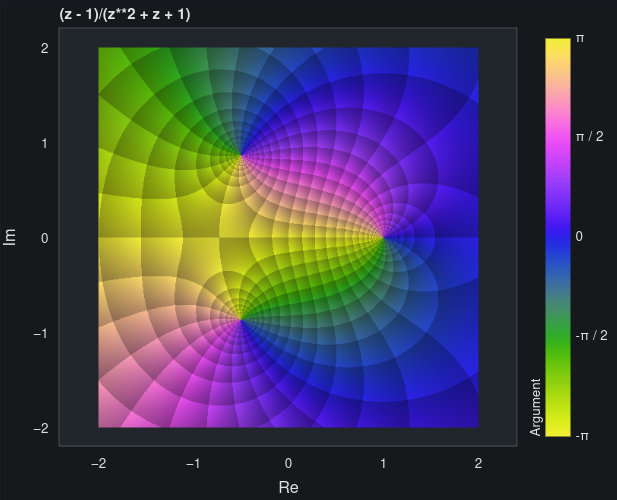

=========
 Overview
=========

The following overview briefly introduce the functionalities exposed by this
module.

Plotting functions
==================

The following functions are exposed by this module:

* ``plot``: visualize a function of a single variable, with the capability
  to correctly visualize discontinuities.
* ``plot_piecewise``: plot piecewise expressions, with the capability
  to correctly visualize discontinuities.
* ``plot_polar``: visualize a curve of a given radius as a function of an
  angle.
* ``plot_list``: visualize numerical data.
* ``plot_parametric``: visualize a 2D parametric curve.
* ``plot3d``: visualize a function of two variables.
* ``plot3d_parametric_line``: visualize a 3D parametric curve.
* ``plot3d_parametric_surface``: visualize a 3D parametric surface.
* ``plot_geometry``: visualize entities from the `sympy.geometry` module.
* ``plot_implicit``: visualize implicit equations / inequalities.
* ``plot_vector``: visualize 2D/3D vector fields with quivers or streamlines.
* ``plot_real_imag``: visualize the real and imaginary parts of a complex
  function.
* ``plot_complex_vector``: visualize the vector field `[re(f), im(f)]` for a
  complex function `f` over the specified complex domain.
* ``plot_complex_list``: visualize list of complex numbers.
* ``plot_complex``: visualize the absolute value of a complex function
  colored by its argument.
* ``get_plot_data``: easily extract the numerical data from symbolic
  expressions, which can later be used to create custom plots with any
  plotting library.
* ``plotgrid``: combine multiple plots into a grid-like layout. It works with
  Matplotlib, Bokeh and Plotly.
* ``iplot``: create parametric-interactive plots using widgets (sliders,
  buttons, etc.)

It is also possible to combine different plots together.

Backends
========

This module allows the user to chose between 4 different backends (plotting
libraries): `Matplotlib <https://matplotlib.org/>`_, `Plotly <https://plotly.com/>`_,
`Bokeh <https://github.com/bokeh/bokeh>`_, `K3D-Jupyter <https://github.com/K3D-tools/K3D-jupyter>`_.

The 2 most important reasons for using a different backend are:

#. **Better interactive** experience (explored in the tutorial section), which
   translates to better data exploration and visualization (especially when
   working with Jupyter Notebook).

#. To use the **plotting library we are most comfortable with**. The backend
   can be used as a starting point to plot symbolic expressions; then, we could
   use the figure object to add numerical (or experimental) results using the
   commands associated to the specific plotting library.

More information about the backends can be found at:
:doc:`Backends </modules/backends/index>` .

Examples
========

The following code blocks shows a few examples about the capabilities of
this module. Please, try them on a Jupyter Notebook to explore the interactive
figures.

Simple 3D plot with K3D-Jupyter:

.. code-block:: python

   from sympy import symbols, cos, pi
   from spb import plot3d, KB
   x, y = symbols("x, y")
   expr = cos(2 * pi * x * y)
   title = r"\text{K3D - Latex Support} \qquad f(x, y) = " + latex(expr)
   plot3d(
       expr, (x, -2, 2), (y, -2, 2),
       use_cm=False, n=300, title=title,
       backend=KB)

.. image:: _static/k3d-2.png
  :width: 600
  :alt: iplot with bokeh

Visualizing a 2D vector field:

.. code-block:: python

   from sympy import symbols
   from spb import plot_vector, PB
   x, y = symbols("x, y")
   expr = Tuple(x**2 - y**2 -4, 2 * x * y)
   plot_vector(
       expr, (x, -5, 5), (y, -5, 5),
       backend=PB,
       n=15, quiver_kw={"scale":0.025},
       theme="plotly_dark",
       xlim=(-5, 5), ylim=(-5, 5),
       title=r"$\vec{F} = " + latex(expr) + "$")

.. image:: _static/plotly-vectors.png
  :width: 600
  :alt: iplot with bokeh

Visualizing a 3D vector field with a random number of streamtubes:

.. code-block:: python

   from sympy import symbols, Tuple
   from spb import plot_vector, KB
   x, y, z = symbols("x, y, z")
   expr = Tuple(-y, -z, x)
   plot_vector(
       expr, (x, -5, 5), (y, -5, 5), (z, -5, 5),
       streamlines=True, n=30,
       backend=KB, grid=False,
       stream_kw={"starts":True, "npoints":500},
       title=r"\vec{F}(x, y, z) = " + latex(expr))

.. image:: _static/k3d_streamtubes.png
  :width: 600
  :alt: iplot with bokeh

Domain coloring plot of a complex function:

.. code-block:: python

   from sympy import symbols
   from spb import plot_complex, BB
   z = symbols("z")
   expr = (z - 1) / (z**2 + z + 1)
   plot_complex(
       expr, (z, -2-2j, 2+2j),
       coloring="b",
       backend=BB, theme="dark_minimal",
       title=str(expr))

3D coloring plot of a complex function:

.. code-block:: python

   from sympy import symbols, latex
   from spb import plot_complex, KB
   z = symbols("z")
   expr = (z - 1) / (z**2 + z + 1)
   plot_complex(
       expr, (z, -2-2j, 2+2j),
       coloring="b", threed=True, zlim=(0, 6),
       backend=KB, grid=False,
       title=latex(expr))

.. image:: _static/k3d_domain_coloring.png
  :width: 600
  :alt: iplot with bokeh

Interactive-Parametric 2D plot of the magnitude of a second order transfer
function:

.. code-block:: python

   from sympy import symbols, log, sqrt, re, im, I
   from spb.interactive import iplot
   from spb import BB
   from bokeh.models.formatters import PrintfTickFormatter
   formatter = PrintfTickFormatter(format="%.3f")
   kp, t, z, o = symbols("k_P, tau, zeta, omega")
   G = kp / (I**2 * t**2 * o**2 + 2 * z * t * o * I + 1)
   mod = lambda x: 20 * log(sqrt(re(x)**2 + im(x)**2), 10)
   iplot(
       (mod(G.subs(z, 0)), (o, 0.1, 100), "G(z=0)"),
       (mod(G.subs(z, 1)), (o, 0.1, 100), "G(z=1)"),
       (mod(G), (o, 0.1, 100), "G"),
       params = {
           kp: (1, 0, 3),
           t: (1, 0, 3),
           z: (0.2, 0, 1, 200, formatter, "z")
       },
       backend = BB,
       n = 2000,
       xscale = "log",
       xlabel = "Frequency, omega, [rad/s]",
       ylabel = "Magnitude [dB]",
       use_latex = False
   )

.. image:: _static/iplot_bokeh_2.png
  :width: 600
  :alt: iplot with bokeh

Differences with sympy.plotting
===============================

* While the backends implemented in this module might resemble the ones from
  the `sympy.plotting` module, they are not interchangeable.

* `sympy.plotting` also provides a ``Plotgrid`` class to combine multiple plots
  into a grid-like layout. This module replaces that class with the
  ``plotgrid`` function. Again, they are not interchangeable.

* The ``plot_implicit`` function has different signature. Moreover, by default
  it uses a mesh grid algorithm and contour plots (in contrast to the adaptive
  algorithm). It is going to automatically switch to an adaptive algorithm if
  Boolean expressions are found. This ensures a better visualization for
  non-Boolean implicit expressions.

* ``experimental_lambdify``, used by `sympy.plotting`, has been almost
  completely removed. It is only used by the plot implicit algorithm. All other
  plot functions use ``lambdify``.

* `sympy.plotting` is unable to visualize summations containing infinity in
  their lower/upper bounds. The new module introduces the ``sum_bound`` keyword
  argument into the ``plot`` function: it substitutes infinity with a large
  integer number. As such, it is possible to visualize summations.

* The adaptive algorithm is also different: this module relies on
  `adaptive <https://github.com/python-adaptive/adaptive/>`_, which allows more
  flexibility.

  * The ``depth`` keyword argument has been removed, while ``adaptive_goal``
    and ``loss_fn`` have been introduced to control the new module.
  * It has also been implemented to 3D lines and surfaces.
  * It allows to generate smoother line plots, at the cost of performance.

* `sympy.plotting` exposed the ``nb_of_points_*`` keyword arguments. These have
  been replaced with ``n`` or ``n1, n2``.

* `sympy.plotting` exposed the ``label``, ``line_color`` and ``surface_color``
  keyword argument. These have been removed in this module.

  The following example compares how to customize a plot created with
  `sympy.plotting` and one created with this module.

  With `sympy.plotting`:

  .. code-block:: python

     from sympy.plotting import plot
     from sympy import symbols, sin, cos
     x = symbols("x")
     p = plot(sin(x), cos(x), show=False)
     p[0].label = "a"
     p[0].line_color = "red"
     p[1].label = "b"
     p.show()

  With this module:

  * it is possible to set a custom label directly from any plot function.
  * by setting specific dictionaries, the full potential of each backend can be
    used by providing backend-specific keyword arguments.

  .. code-block:: python

     from spb import plot
     from sympy import symbols, sin, cos
     x = symbols("x")
     p1 = plot(sin(x), "a", backend=MB, show=False, line_kw=dict(color="k", linestyle=":"))
     p2 = plot(cos(x), "b", backend=MB, show=False)
     p3 = (p1 + p2)
     p3.show()

  Therefore, setting attributes to plot objects or to data series after they
  have been instantiated is strongly unrecommended. Read the documentation
  to learn how to further customize the appearance of figures.

Take a look at :doc:`Modules </modules/index>` for more examples about the output of this module.
