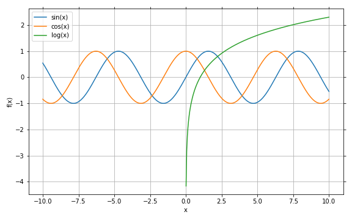
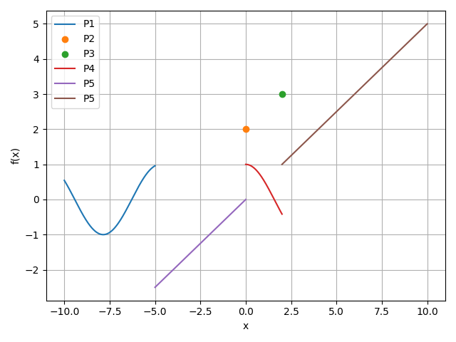

1 - 2D Backends
---------------

In this tutorial we are going to examine the 2D capabilities of this plotting
module, whose major objective is to integrate modern interactive plotting
libraries with SymPy. We are also going to illustrate a couple of important
capabilities:

1. Correct detection and plotting of singularities.
2. Correct visualization of `Piecewise`` expressions.

Comparison between 2D backends
==============================

Let's start by comparing the 2D backends. First, we will show the results with
Matplotlib, and explain the limitations. Then we will show what a different
backend can do.

.. code-block:: python

    %matplotlib widget
    from sympy import *
    from spb import *
    from spb.backends.matplotlib import MB
    from spb.backends.plotly import PB
    from spb.backends.bokeh import BB
    var("u, v, x, y")

In the above code cell we first imported every plot function from available from
this plotting module. Remember: while some plot functions from this module are
identical to the ones from ``sympy``, they are not compatible when using
a different backend!

We also imported three backends. The following backends are available from the
following submodules:

+-----------------------+---------------------+-------+
|       Sub-module      | Backend             | Alias |
+=======================+=====================+=======+
|   backends.bokeh      |   BokehBackend      |   BB  |
+-----------------------+---------------------+-------+
|   backends.matplotlib |   MatplotlibBackend |   MB  |
+-----------------------+---------------------+-------+
|   backends.plotly     |   PlotlyBackend     |   PB  |
+-----------------------+---------------------+-------+
|   backends.k3d        |   K3DBackend        |   KB  |
+-----------------------+---------------------+-------+

Only ``MatplotlibBackend``, ``BokehBackend`` and ``PlotlyBackend`` support
2D plots.

.. code-block:: python

    plot(sin(x), cos(x), log(x), backend=MB)

Once we plot multiple expression simultaneously, the legend will automatically
show up. We can disable it by setting ``legend=False``.

Note that:

* In order to interact with it we have to use the buttons on the toolbar.
* If we move the cursor over the plot, we can see its coordinates. With this
  behaviour we can only get approximate coordinates if we move the cursor over
  a line.

Let's visualize the same plot with ``PlotlyBackend``:

.. code-block:: python

    plot(sin(x), cos(x), log(x), backend=PB)

.. raw:: html
    
    <iframe src="../_static/tut-1/fig-02.html" height="500px" width="100%"></iframe>
    
We can also interact with this plot using the top toolbar, however there are
more natural ways:

* Click and drag to zoom into a rectangular selection.
* Move the cursor in the middle of the horizontal axis, click and drag to pan
  horizontally.
* Move the cursor in the middle of the vertical axis, click and drag to pan
  vertically.
* Move the cursor near the ends of the horizontal/vertical axis: click and drag
  to resize.
* Move the cursor over a line: a tooltip will show the coordinate of that point
  in the data series. Note that there is no interpolation between two
  consecutive points.
* Click over a label in the legend to hide/show that data series.

Let's now visualize the same plot with ``BokehBackend``:

.. code-block:: python

    plot(sin(x), cos(x), log(x), backend=BB)

.. raw:: html
	:file: figs/tut-1/fig-03.html

Here, we can:

* Click and drag to pan the plot around. Once we are done panning, the plot
  automatically updates all the data series according to the new range.
  This is a wonderful feature of Bokeh, which allows us to type less and
  explore more.
* Click and drag the axis to pan the plot only on one direction.
* Click the legend entries to hide/show the data series.
* Move the cursor over a line: a tooltip will show the coordinate of that point
  in the data series.
* Use the toolbar to change the tool, for example we can select the _Box Zoom_
  to zoom into a rectangular region.

Is some occasion, it might be helpful to assign a custom label to a specific
expression. We can do that in the following way:

.. code-block:: python

    plot((cos(x), "$f_{1}$"), (sin(x), "$f_{2}$"), (log(x), "$f_{3}$"),
            backend=MB, legend=True, title="Latex Support",
            xlabel=r"$\xi$", ylabel=r"$\eta$", detect_poles=False)

.. figure:: ../_static/tut-1/fig-04.png

At the time of writing this, there might be problems when using Plotly with
Latex on Firefox (https://github.com/plotly/plotly.js/issues/5374).

Also, note that, differently from Matplotlib and Plotly, Bokeh doesn't
support Latex!

Singularity Detection
=====================

Another difference in comparison with the SymPy plotting module is that we can
chose to correctly plot singularities (or at least try to). By default, this
detection is turned off, for example:

.. code-block:: python

    plot(tan(x), (x, -10, 10), backend=PB)

.. raw:: html
    
    <iframe src="../_static/tut-1/fig-05.html" height="500px" width="100%"></iframe>

As we can see, the plot is hardly readable:
* There is a pretty huge data range covered by the y-axis, thus "flattening"
  the non-linearities.
* There is a continous line that connects the points even through singularities.

We can turn-on the singularity detection by setting ``detect_poles=True``:

.. code-block:: python

    plot(tan(x), (x, -10, 10), backend=PB, detect_poles=True)

.. raw:: html
    
    <iframe src="../_static/tut-1/fig-06.html" height="500px" width="100%"></iframe>

Here:

* There is a clear separation where the singularities are located.
* A better y-axis range has been automatically chosen. 
  **Warning**: the algorithm is still at its infancy, so it might be possible
  that a very small y-range is chosen. In such cases we can re-execute the plot
  command or we can manually set the ``ylim`` keyword argument.
* Thanks to the interactive nature of Plotly, we can easily scroll the y-axis
  in order to explore the data.

It is important to realize that the finer the discretization of the domain, the
better the detection. Therefore, it might be necessary to either increase the
``depth`` of the adaptive algorithm (default value to 9), or set
``adaptive=False`` and ``n=2000`` (some arbitrary large number). Also, as a
last resort, one might also change the value of ``eps`` (default to 0.1).

Note that there is a bias in the y-axis: it is not perfectly centered.
That's perfectly fine with this initial implementation of the singularity
detection. We can easily fix it by scrolling the y-axis or by setting the
``ylim`` keyword:

.. code-block:: python

    plot(tan(x), (x, -10, 10), backend=PB, detect_poles=True, ylim=(-7, 7))

.. raw:: html
    
    <iframe src="../_static/tut-1/fig-07.html" height="500px" width="100%"></iframe>

Plotting Piecewise functions
============================

Finally, we can also correctly plot ``Piecewise`` expressions, for example:

.. code-block:: python

    pf = Piecewise(
        (sin(x), x < -5),
        (2, Eq(x, 0)),
        (3, Eq(x, 2)),
        (cos(x), (x > 0) & (x < 2)),
        (tan(x), True)
    )
    display(pf)
    plot(pf, backend=MB, detect_poles=True)

As a design choice, the algorithm is going to extract the different pieces and
plot them separately. Note that points are visible too!