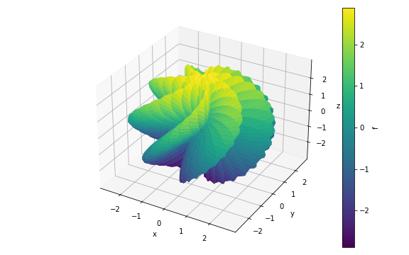

2 - 3D Backends
---------------

Three backends support 3D plotting: ``PlotlyBackend``, ``K3DBackend`` and
``MatplotlibBackend``.

.. code-block:: python

    %matplotlib widget
    from sympy import *
    from spb import *
    from spb.backends.plotly import PB
    from spb.backends.k3d import KB
    from spb.backends.matplotlib import MB
    import numpy as np
    var("u, v, x, y")

First, let's examine a plot created with Matplotlib:

.. code-block:: python

    r = 2 + sin(7 * u + 5 * v)
    expr = (
        r * cos(u) * sin(v),
        r * sin(u) * sin(v),
        r * cos(v)
    )
    plot3d_parametric_surface(*expr, (u, 0, 2 * pi), (v, 0, pi), backend=MB)

Here, we can guess what the exact shape of the surface is going to be. We could
increase the number of discretization points, in the ``u`` and ``v`` directions,
but we are not going to do that with Matplotlib and ipympl (too slow, it would
be a suicide). As always, we can use the toolbar buttons to zoom in and out.
Now, try to click and drag the surface: there is a lot of lag. Matplotlib and
ipympl is not designed to be interactive.

Let's plot the same surface with ``K3DBackend``. Since we are at it, let's also
bump up the number of discretization points to 500 on both parameters.
The resulting mesh will have 250 thousand points, therefore the computation may
take a few seconds (depending on our machine). Note one major difference with
SymPy's plotting module: to specify the same numer of discretization points on
both directions we can use the keyword argument ``n``. Alternatively, we could
use ``n1`` and ``n2`` to specify different numbers of discretization points.

.. code-block:: python

    n = 500
    plot3d_parametric_surface(*expr, (u, 0, 2 * pi), (v, 0, pi),
                            backend=KB, n=n)

.. raw:: html
	:file: figs/tut-2/fig-02.html

To interact with the plot:

* Left click and drag: rotate the plot.
* Scroll with the mouse wheel: zoom in and out.
* Right click and drag: pan.

Note how smooth the interaction is!!!

On the top right corner there is a menu with a few entries:

* **Controls**: we can play with a few options, like hiding the grids, going
  full screen, ..., add and remove clipping planes.
* **Objects**: we can see the objects displayed on the plot. Let's click the
  ``Mesh #1`` entry: we can hide/show the object, its color legend, we can turn
  on wireframe view (don't do it with such a high number of points, it will
  slows things down a lot!). Note that by default a color map is applied to the
  surface, hence we cannot change its color from the Controls. We will see later
  how to do it.
* **Info**: useful information for debug purposes.

It is left to the Reader to play with the controls and learn what they do.

Note that the name of the surface displayed under **Objects** is ``Mesh #1``.
If we plot multiple expressions, the names will be ``Mesh #1``, ``Mesh #2``,
etc. This is the default behaviour for ``K3DBackend``. We can also chose to
display the string representation of the expression by setting
``show_label=True``, but it is safe to assume that the label won't fit the
small amount of width of the **Controls** user interface, therefore it makes
sense to leave that option unset.

Let's now look at a simple example which illustrate that no matter what backend
we are using, we ultimately have to decide if the plot is correct or not:

.. code-block:: python

    expr = re(atan(x + I*y))
    n = 200
    plot3d(expr, backend=KB, n=n)

.. raw:: html
	:file: figs/tut-2/fig-03.html

Here, the vertical wall at $x=0$ is rendered, but should not!!! There is a
discontinuity there.

As we can see above, by default a color map is applied to the surface, ranging
from the minimum and maximum value of the z-coordinate. If we wish to switch to
an automatic solid coloring, we need to set the ``use_cm=False``. Also, keep in
mind that K3D natively support latex. Let's try it:

.. code-block:: python

    n = 500
    expr = cos(2 * pi * x * y)
    plot3d(expr, (x, -2, 2), (y, -2, 2), backend=KB,
        n=n, use_cm=False,
        title=r"\text{K3D - Latex support} \qquad f(x, y) = " + latex(expr))

.. raw:: html
	:file: figs/tut-2/fig-04.html

.. code-block:: python

    n = 100
    expr = (
        2 * (1 - exp(u / (6 * pi))) * cos(u) * cos(v / 2)**2,
        2 * (-1 + exp(u / (6 * pi))) * sin(u) * cos(v / 2)**2,
        1 - exp(u / (3 * pi)) - sin(v) + exp(u / (6 * pi)) * sin(v)
    )
    plot3d_parametric_surface(*expr, (u, 0, 6*pi), (v, 0, 2*pi),
                            backend=KB, n=n, use_cm=True)

.. raw:: html
	:file: figs/tut-2/fig-05.html

Let's now try ``PlotlyBackend``. The main difference between ``PlotlyBackend``
and ``K3DBackend`` is that the former can stretch the axis, whereas the latter
(being more engineering-oriented) uses a fixed aspect ratio representing
reality. We can control this behaviour by setting an appropriate value for the
``aspect`` keyword:

.. code-block:: python

    plot3d_parametric_surface(*expr, (u, 0, 2**pi), (v, 0, 2*pi),
                            backend=PB, n=n, aspect="cube")

.. raw:: html
	:file: figs/tut-2/fig-06.html

Note that the z axis is stretched!

The two other major differences are:

* ``PlotlyBackend`` is consistently slower at rendering 3D objects than the
  other two backends.
* ``PlotlyBackend`` doesn't natively support wireframe. While it is possible to
  draw wireframe by setting ``wireframe=True``, it will significantly slow down
  the rendering process, even for a small number of discretization points.
  Therefore, it is advisable not to use wireframes with Plotly.
* By moving the cursor over the surface, we can actually see the coordinates of
  the "selected" point. This is not currently possible with ``K3DBackend``.

.. code-block:: python

    n = 100
    expr = (
        (-(2/15) * cos(u) * (3 * cos(v) - 30 * sin(u) + 90 * cos(u)**4 * sin(u) -
        60 * cos(u)**6 * sin(u) + 5 * cos(u) * cos(v) * sin(u))),
        (-(1/15) * sin(u) * (3 * cos(v) - 3 * cos(u)**2 * cos(v) - 48 * cos(u)**4 * cos(v) +
        48 * cos(u)**6 * cos(v) - 60 * sin(u) + 5 * cos(u) * cos(v) * sin(u)
        - 5 * cos(u)**3 * cos(v) * sin(u) - 80 * cos(u)**5 * cos(v) * sin(u) +
        80 * cos(u)**7 * cos(v) * sin(u))),
        (2/15) * (3 + 5 * cos(u) * sin(u)) * sin(v)
    )
    plot3d_parametric_surface(*expr, (u, 0, pi), (v, 0, 2 * pi),
                            backend=PB, n=n)

.. raw:: html
	:file: figs/tut-2/fig-07.html

.. code-block:: python

    # https://mathematica.stackexchange.com/a/37715
    expr = (
        cos(v) * (6 - (5/4 + sin(3 * u)) * sin(u - 3 * v)), 
        (6 - (5/4 + sin(3 * u)) * sin(u - 3 * v)) * sin(v), 
        -cos(u - 3 * v) * (5/4 + sin(3 * u))
    )
    plot3d_parametric_surface(*expr, (u, 0, 2 * pi), (v, 0, 2 * pi),
                            backend=KB, n=n)

.. raw:: html
	:file: figs/tut-2/fig-08.html
