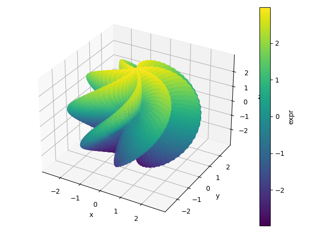
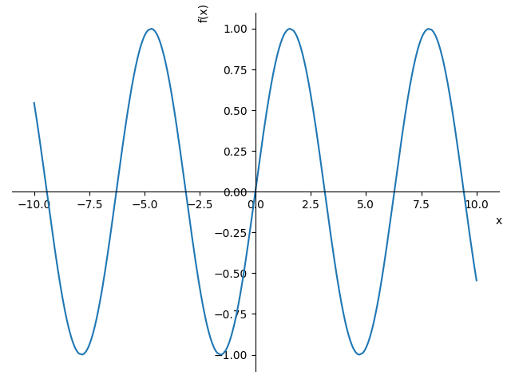

.. _Tutorial 4:

4 - Customizing the module
--------------------------

Let's suppose we have identified two backends that we like (one for 2D plots,
the other for 3D plots). Then, instead of providing the keyword
``backend=SOMETHING`` each time we need to create a plot, we can customize the
module to make the plotting functions use our backends. Moreso, it is also
possible to customize the appearance of the backends.

Let's import the necessary tools and visualize the current settings:

.. code-block:: python

   from spb.defaults import cfg, set_defaults
   display(cfg)

Here, we can see the settings associated to the 4 backends: ``'plotly'``,
``'bokeh'``, ``'matplotlib'``, ``'k3d'``. We will discuss each option later on.

Let's learn how to use the ``set_defaults`` function:

.. code-block:: python

   help(set_defaults)

We need to change the values in the ``cfg`` dictionary and then use the
``set_defaults`` function to apply the new configurations.

Let's say we would like to:

* use Plotly for 2D plots and Matplotlib for 3D plots;
* use ``"seaborn"`` theme in Plotly. We can use `help(PB)` (or any other
  backend) to read the documentation associated to each backend, in which we
  will find links towards the official documentation of the plotting library,
  where we will find the available themes.

Then:

.. code-block:: python

   # we write the name of the plotting library
   # available options: bokeh, matplotlib, k3d, plotly
   cfg["backend_2D"] = "plotly"
   cfg["backend_3D"] = "matplotlib"
   # the following depends on the plotting library
   cfg["plotly"]["theme"] = "seaborn"
   set_defaults(cfg)

Note that if we insert invalid options, the module will automatically reset
to the default settings!

Now, let's restart the kernel in order to make changes effective.
Then, we can test test them right away.

.. code-block:: python

   from sympy import *
   from spb import *
   var("u, v, x, y")
   plot(sin(x), cos(x), log(x))

.. raw:: html

   <iframe src="../_static/tut-1/plotly-1.html" height="500px" width="100%"></iframe>

.. code-block:: python

   n = 125
   r = 2 + sin(7 * u + 5 * v)
   expr = (
       r * cos(u) * sin(v),
       r * sin(u) * sin(v),
       r * cos(v)
   )
   plot3d_parametric_surface(*expr, (u, 0, 2 * pi), (v, 0, pi), "expr", n=n)

Available Options
=================

Let's now discuss a few customization options:

.. code-block:: python

   # Set the default evaluation algorithm for line plots:
   # True: use adaptive algorithm
   # False: use uniform mesh algorithm
   cfg["adaptive"]["used_by_default"] = True
   # Set the "smoothness" goal for the adaptive algorithm.
   # Lower values create smoother lines, at the cost of
   # performance.
   cfg["adaptive"]["goal"] = 0.01

   # Set the overall plot range to be used when the plotting
   # variable is not specified.
   cfg["plot_range"]["min"] = -10
   cfg["plot_range"]["max"] = 10

   # Set the location of the intersection between the horizontal and vertical
   # axis of Matplotlib (only works for 2D plots). Possible values:
   #       "center", "auto" or None
   # If None, use a standard Matplotlib layout with vertical axis on the left,
   # horizontal axis on the bottom.
   cfg["matplotlib"]["axis_center"] = None
   # Turn on the grid on Matplotlib figures
   cfg["matplotlib"]["grid"] = True
   # Show minor grids
   cfg["matplotlib"]["show_minor_grid"] = True

   # Find more Plotly themes at the following page:
   # https://plotly.com/python/templates/
   cfg["plotly"]["theme"] = "seaborn"
   # Turn on the grid on Plotly figures
   cfg["plotly"]["grid"] = True

   # Find more Bokeh themes at the following page:
   # https://docs.bokeh.org/en/latest/docs/reference/themes.html
   cfg["bokeh"]["theme"] = "caliber"
   # Activate automatic update event on panning
   cfg["bokeh"]["update_event"] = True
   # Turn on the grid on Bokeh figures
   cfg["bokeh"]["grid"] = True
   # Show minor grids
   cfg["bokeh"]["show_minor_grid"] = True
   # depending on the used Bokeh `themes`, we will need
   # to adjust the opacity of the minor grid lines
   cfg["bokeh"]["minor_grid_line_alpha"] = 0.6
   # controls the spacing of the dashes in minor grid lines
   cfg["bokeh"]["minor_grid_line_dash"] = [2, 2]

   # Turn on the grid on K3D-Jupyter figures
   cfg["k3d"]["grid"] = True
   # K3D-Jupyter colors are represented by an integer number.
   cfg["k3d"]["bg_color"] = 0xffffff
   cfg["k3d"]["grid_color"] = 0xE6E6E6
   cfg["k3d"]["label_color"] = 0x444444

   # we can set the numerical evaluation library for complex plots.
   # Available options: "mpmath" or None (the latter uses Numpy/Scipy)
   cfg["complex"]["modules"] = None
   # set a default (complex) domain coloring option.
   cfg["complex"]["coloring"] = "b"

   # Specify the default interactive module for widgets. Can be:
   # "ipywidgets" or "panel"
   cfg["interactive"]["module"] = "ipywidgets"
   # Visualize Latex labels in the widgets of `iplot`
   cfg["interactive"]["use_latex"] = True
   # Controls wether sliders trigger the update of `iplot`at each
   # tick (value False) or only when the mouse click is released
   # (value True)
   cfg["interactive"]["throttled"] = False

Let's consider ``MatplotlibBackend``. Let's suppose we would like to use
the old plotting module style:

.. code-block:: python

   plot(sin(x), backend=MB, axis_center="auto", grid=False)

Then, we can modify the ``cfg`` dictionary and execute the ``set_defaults``
function, finally restarting the kernel to make the changes effective.

Resetting the configuration file
================================

Suppose we would like to go back to the original default settings. Then:

.. code-block:: python

   from spb.defaults import reset
   reset()

Now, we restart the kernel and the plotting module is back at its
original state.
