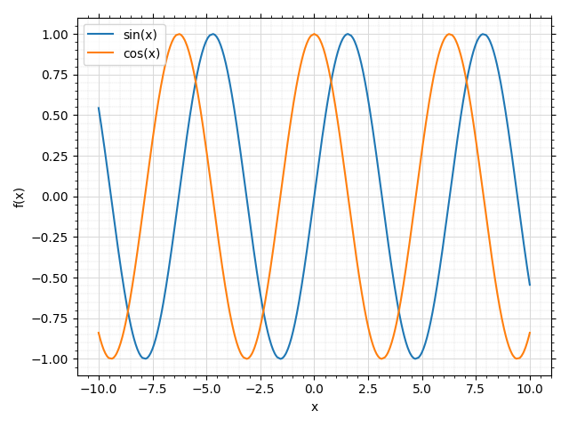
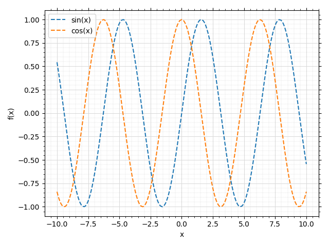
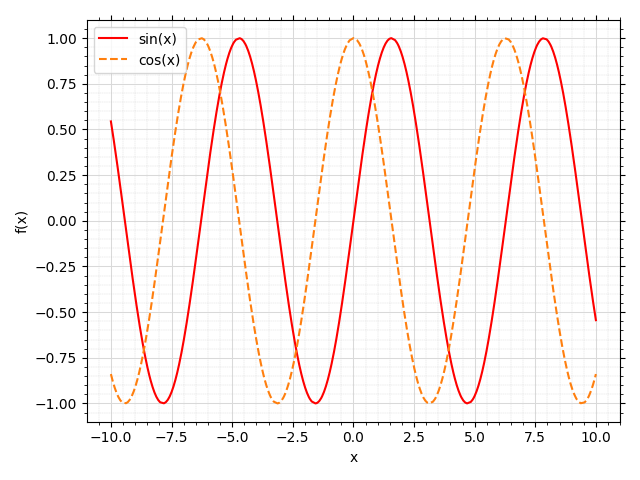
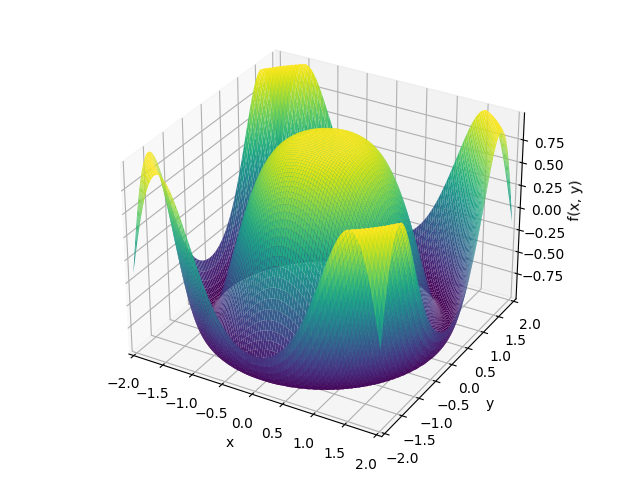
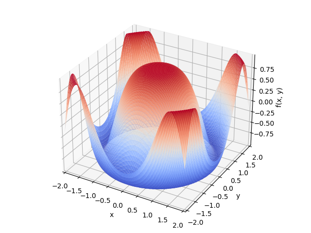
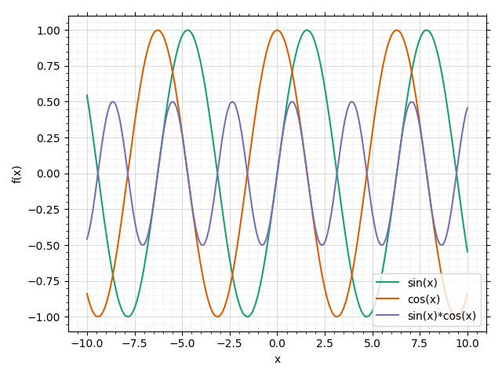

5 - Colors and Colormaps
------------------------

Backends apply default rendering settings to the objects of the figure
depending on the type of plot we are generating. For example, when executing the ``plot()`` function, backends use solid color and solid line style.
When executing ``plot_parametric()`` or ``plot3d()``, they use colormaps.

In this tutorial we are going to see how to modify this rendering options.
It is assumed that the default backend is Matplotlib, both for 2D and 3D plots.

Change rendering options
========================

Let's start by plotting a couple of expressions. By default, the backend will
apply a colorloop so that each expression gets a unique color.

.. code-block:: python

   from sympy import *
   from spb import *
   var("x, y")
   plot(sin(x), cos(x))

We can modify the styling of the lines by providing backend-specific commands
through the ``line_kw`` argument, which will be passed directly to the
backend-specific function responsible to draw lines.

Each plotting function exposes a different option, for example ``plot3d()``
exposes ``surface_kw``, ``plot_contour()`` exposes ``contour_kw``, etc.
This design choice allowed to create plotting functions that combine several elements, for example ``plot_vector()`` can combine a contour plot with
quivers or streamlines, thus it exposes ``contour_kw``, ``quiver_kw``,
``stream_kw``.

Let's try to apply a dashed line style:

.. code-block:: python

   plot(sin(x), cos(x), line_kw=dict(linestyle="--"))

As we can see, the same style has been applied to every series. What if we
would like to apply different styles to different series? We can create
different plots and combine them together:

.. code-block:: python

   p1 = plot(sin(x), show=False, line_kw=dict(color="red"))
   p2 = plot(cos(x), show=False, line_kw=dict(linestyle="--"))
   p3 = p1 + p2
   p3.show()

Note that the second series, `cos(x)`, is using the automatic color provided
by the backend.

Now, let's try to do the same with Plotly. Note that the ``line_kw`` options
are different!

.. code-block:: python

   p1 = plot(sin(x), show=False, line_kw=dict(line_color="green"), backend=PB)
   p2 = plot(cos(x), show=False, line_kw=dict(line_dash="dash"), backend=PB)
   p3 = p1 + p2
   p3.show()

.. raw:: html

   <iframe src="../_static/tut-5/fig_6.html" height="400px" width="100%"></iframe>

Let's now use same concepts with a 3D plot. This is the default look:

.. code-block:: python

   plot3d(cos(x**2 + y**2), (x, -2, 2), (y, -2, 2))

Now, let's change the colormap:

.. code-block:: python

   import matplotlib.cm as cm
   plot3d(cos(x**2 + y**2), (x, -2, 2), (y, -2, 2),
       surface_kw=dict(cmap=cm.coolwarm))

Custom color loop and colormaps
===============================

We can also modify the color loop and the colormaps used by the backend.
Each backend exposes the ``colorloop`` and ``colormaps`` class attributes,
which are empty lists:

.. code-block:: python

   print(MB.colorloop)
   print(MB.colormaps)

.. code-block:: text

   []
   []

We can fill these list with our preferred colors or colormaps.
For example:

.. code-block:: python

   import matplotlib.cm as cm
   MB.colorloop = cm.Dark2.colors
   plot(sin(x), cos(x), sin(x) * cos(x))

Note that ``cm.Dark2.colors`` returns a list of colors. By comparing this
picture with the ones at the beginning, we can confirm that the colorloop
has changed.

After setting these two class attribute, every plot will use the new
colors, until the kernel is restarted or the attributes are set to empty lists.

Let's try a 3D plot with default colormaps:

.. code-block:: python

   expr = cos(x**2 + y**2)
   p = plot3d(
       (expr, (x, -2, 0), (y, -2, 0)),
       (expr, (x, 0, 2), (y, -2, 0)),
       (expr, (x, -2, 0), (y, 0, 2)),
       (expr, (x, 0, 2), (y, 0, 2)),
       n = 20, backend=PB
   )

.. raw:: html

   <iframe src="../_static/tut-5/plotly3d.html" height="400px" width="100%"></iframe>

Now, let's change the colormaps:

.. code-block:: python

   import colorcet as cc
   expr = cos(x**2 + y**2)
   PB.colormaps = ["solar", "aggrnyl", cm.coolwarm, cc.kbc]
   p = plot3d(
       (expr, (x, -2, 0), (y, -2, 0)),
       (expr, (x, 0, 2), (y, -2, 0)),
       (expr, (x, -2, 0), (y, 0, 2)),
       (expr, (x, 0, 2), (y, 0, 2)),
       n = 20, backend=PB
   )

.. raw:: html

   <iframe src="../_static/tut-5/plotly3d-2.html" height="400px" width="100%"></iframe>

Note that all backend are able to use colormaps from a different
plotting library!
