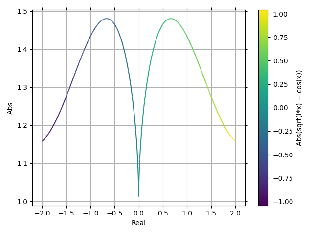
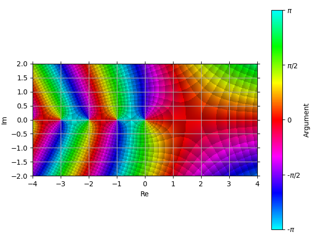

7 - Complex Plot
----------------

This module exposes the ``plot_complex`` function which can be used to create
different kinds of plot:

1. Plotting lists of complex numbers.
2. Plotting over a real range the real and imaginary part of a complex function.
3. Plotting over a real range the absolute value of a complex function colored
   by its argument.
4. 3D plot of the real/imaginary part, absolute value and argument of a
   function of two variables.
5. Domain coloring of a complex function over a complex domain.
6. 3D plot of the absolute value of a complex function colored by its argument.

In the following tutorial we are not going to explore them all. Instead, we
will focus on the differences between the backends.

.. code:: ipython3

    %matplotlib widget
    from sympy import *
    from spb import *
    from spb.backends.plotly import PB
    from spb.backends.k3d import KB
    from spb.backends.matplotlib import MB
    var("x:z")
    help(plot_complex)

Functions of 1 Variable
=======================

Let's say we'd like to plot the real and imaginary parts of a complex function
over a real range. All we have to do is the following:

.. code:: ipython3

    expr = cos(x) + sqrt(I * x)
    plot_complex(expr, (x, -2, 2), backend=PB)

.. raw:: html
	:file: figs/tut-7/fig-01.html

We set ``absarg=True`` in order to create a plot of the magnitude of a complex
function colored by its argument:

.. code:: ipython3

    plot_complex(expr, (x, -2, 2), absarg=True, backend=PB)

.. raw:: html
	:file: figs/tut-7/fig-02.html

Note that Plotly is unable to plot gradient lines, so the change in phase is
represented by colored markers. By hovering the markers we get a tooltip
telling us useful information.

Let's try a different backend:

.. code:: ipython3

    plot_complex(expr, (x, -2, 2), absarg=True, backend=MB)

If we are only interested in the absolute value without argument-coloring,
we can set ``use_cm=False``:

.. code:: ipython3

    plot_complex(expr, (x, -2, 2), absarg=True, use_cm=False, backend=PB)

.. raw:: html
	:file: figs/tut-7/fig-04.html

Note that we can visualize every quantity by turning on the respective flag:

.. code:: ipython3

    plot_complex(expr, (x, -2, 2), real=True, imag=True, abs=True,
        arg=True, backend=PB)

.. raw:: html
	:file: figs/tut-7/fig-05.html

The numerical data of all the above plots have been generated with Numpy.
We can also choose Mpmath by setting ``modules="mpmath"``: this option will be
passed to ``lambdify``. Note that the numerical evaluation with Mpmath is slower
than Numpy, but the results are different when branch cuts are involved.
Let's illustrate the differences by plotting the imaginary part of a function:

.. code:: ipython3

    p1 = plot_complex((asin(x), (x, -5, 5), "numpy"), real=False, imag=True,
        show=False)
    p2 = plot_complex((asin(x), (x, -5, 5), "mpmath"), real=False, imag=True,
        modules="mpmath", show=False)
    (p1 + p2).show()

.. raw:: html
	:file: figs/tut-7/fig-06.html

As we can see, there are regions in the plot where Numpy and Mpmath computes
the same imaginary part, and other regions where the imaginary parts have
opposite sign. This also leads to different arguments:

.. code:: ipython3

    p1 = plot_complex((asin(x), (x, -5, 5), "numpy"), real=False, imag=False, 
            arg=True, show=False)
    p2 = plot_complex((asin(x), (x, -5, 5), "mpmath"), real=False, imag=False,
            arg=True, modules="mpmath", show=False)
    (p1 + p2).show()

.. raw:: html
	:file: figs/tut-7/fig-07.html

The above results are also valid when creating domain coloring plots
(next section). Therefore, the user should carefully select the numerical
library according to his/her preferences and objectives.

Functions of 2 Variables
========================

Similar to the above examples, we can also plot the real part, the imaginary
part and the absolute value of a function of 2 variables over two real ranges.
Again, we can control what to show by toggling
``real=True, imag=True, abs=True``. For example:

By default, when no keyword arguments is passed, the real and imaginary parts
are going to be plotted:

.. code:: ipython3

    plot_complex(sqrt(x * y), (x, -5, 5), (y, -5, 5))

.. raw:: html
	:file: figs/tut-7/fig-08.html

To plot only the imaginary part:

.. code:: ipython3

    plot_complex(sqrt(x * y), (x, -5, 5), (y, -5, 5), real=False, imag=True)

.. raw:: html
	:file: figs/tut-7/fig-09.html

To plot the absolute value:

.. code:: ipython3

    plot_complex(sqrt(x * y), (x, -5, 5), (y, -5, 5),
        real=False, imag=False, abs=True)

.. raw:: html
	:file: figs/tut-7/fig-10.html

Domain Coloring
===============

`Domain coloring <https://en.wikipedia.org/wiki/Domain_coloring>`_ is a
technique for visualizing complex functions by assigning a color to each point
of the complex plane.

This module implements several color schemes based on Elias Wegert's book
`"Visual Complex Functions" <https://www.springer.com/de/book/9783034801799>`_.
The book provides the background to better understand the images.
Find out the available ``coloring`` options by reading ``plot_complex``
documentation.

Let's start with the default:

.. code:: ipython3

    plot_complex(gamma(z), (z, -4 - 2 * I, 4 + 2 * I), backend=PB)

.. raw:: html
	:file: figs/tut-7/fig-11.html

More generally, we can think of the result of domain coloring as a picture.
The complex domain is discretized with ``n1`` points in the horizontal
direction and `n2` points in the vertical direction. Therefore, the picture
will have ``(n1 - 1) (n2 - 1)`` pixels. We can increase ``n1`` and ``n2`` to
refine the result, however Plotly will become slower and slower in rendering
the results. In such cases, it is better to use a different backend,
as we will later see.

Note that:

* By default, domain coloring plots automatically set ``aspect="equal"``. 
* Plotly has a *bug*: the vertical axis is reversed, with negative values on
  the top and positive values on the bottom. We will get back to it later!

Let's now try a different coloring with ``MatplotlibBackend``:

.. code:: ipython3

    plot_complex(gamma(z), (z, -4 - 2 * I, 4 + 2 * I),
        coloring="b", backend=MB)

Note how much faster the picture was generated: there is no javascript
involved. However, we lost a lot of information: by hovering over the picture,
we are only going to see the pointer coordinates.

We can also plot the absolute value of the complex function colored by its
argument in 3D, by setting ``threed=True``:

.. code:: ipython3

    plot_complex(gamma(z), (z, -4 - 2 * I, 4 + 2 * I), 
        backend=PB, threed=True, zlim=(0, 10), n=100)

.. raw:: html
	:file: figs/tut-7/fig-13.html

There are a few things to point out:

* by default, Plotly is not keeping a fixed aspect ratio.
* by zooming in, we can see some "segmented" lines separating colors: the
  underlying data is correct, whereas those lines are caused by the
  interpolation used by Plotly. Essentially, Plotly is interpolating the
  argument and it is unaware that the it is periodic. Once the periodic jump
  is reached, those lines will appear. We can minimize the problem by bumping
  up the number of discretization points.
* there is even a worse
  `bug with Plotly <https://github.com/plotly/plotly.js/issues/5003>`_
  with 3D surfaces and complex plots: when we hover a point, the tooltip will
  display wrong information for the argument and the phase. Hopefully this bug
  will be fixed upstream.

Instead of typing `threed=True`, we might use the `plot_complex3d` function,
which is just a wrapper function to `plot_complex` that sets the flag for us.

Let's try a different coloring with K3D:

.. code:: ipython3

    plot_complex3d(gamma(z), (z, -4 - 2 * I, 4 + 2 * I), coloring="b",
        backend=KB, zlim=(0, 10))

.. raw:: html
	:file: figs/tut-7/fig-14.html

Considering that complex functions can go to infinity, a fixed-aspect ratio
plotting library (like K3D) might not be the best choice! Here we set ``zlim``
and ``K3DBackend`` added a couple of clipping planes. We can delete them by
opening the menu "Controls -> Clipping Planes".

We can also plot the real, imaginary and absolute value separately by using
the respective flags:

.. code:: ipython3

    plot_complex3d(gamma(z), (z, -4 - 2 * I, 4 + 2 * I), backend=KB, 
        zlim=(0, 10), real=True, imag=True, abs=True)

.. raw:: html
	:file: figs/tut-7/fig-15.html

Again, we can use "Cotrols -> Objects" and chose which mesh to hide.

Finally, note that we can set a default value for the ``coloring``. Refer to 
tutorial 3 and set ``cfg["complex"]["coloring"]`` to one of the values
specified in ``help(plot_complex)``.

Interactive plots
=================

We can also use ``iplot`` to create interactive complex plots. We must
remember to set `is_complex=True`. Keep in mind that some backend might not
support all functionalities listed above.

from spb.interactive import iplot

.. code:: ipython3

    iplot(
        (z * sin(x * z) * exp(2 * pi * I / (y * z)), (z, -5, 5)),
        params = {
            x: (1, (0, 3)),
            y: (1, (-5, 5)),
        },
        is_complex = True,
        backend = PB,
        absarg = True,
        n1 = 2000
    )

The user can change ``absarg=False`` and rerun the plot.

Let's now try to plot the real part of a function of 2 variables:

.. code:: ipython3

    iplot(
        (sqrt(x**z * y), (x, -5, 5), (y, -5, 5)),
        params = {
            z: (1, (0, 2))
        },
        backend = KB,
        is_complex = True,
        real = True,
        threed = True
    )

Let's now try with a domain coloring plot:

.. code:: ipython3

    iplot(
        ((z**2 + 1) / (x * (z**2 - 1)), (z, -4 - 2 * I, 4 + 2 * I)),
        params = {
            x: (1, (-2, 2))
        },
        backend = MB,
        is_complex = True,
        coloring = "b"
    )

Finally, let's try with a 3D. Keep in mind that the update might be slow:

.. code:: ipython3

    iplot(
        ((z**2 + 1) / (x * (z**2 - 1)), (z, -4 - 2 * I, 4 + 2 * I)),
        params = {
            x: (1, (-2, 2))
        },
        backend = KB,
        threed = True,
        is_complex = True,
        coloring = "b",
        zlim = (0, 6)
    )
