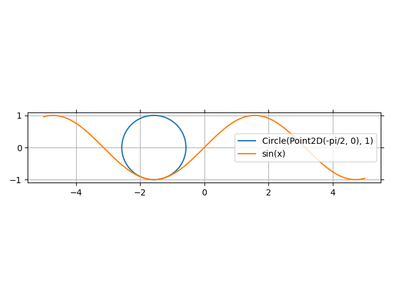

9 - Only 1 Plot Function
------------------------

Let's list all the specialized plot functions:

* ``plot``: to plot univariate expressions.
* ``plot_parametric``: to plot univariate 2D parametric expressions.
* ``plot3d``: to plot functions/expressions of 2 variables.
* ``plot3d_parametric_line``: to plot univariate 3D parametric expressions.
* ``plot3d_parametric_surface``
* ``plot_contour``: to draw contours of functions/expressions of 2 variables.
* ``plot_implicit``: to plot relationals and boolean expressions.
* ``plot_vector``: to plot vector fields.
* ``plot_complex``: to plot complex functions.
* ``plot_geometry``: to plot entities from ``sympy.geometry`` module.

Those are many functions and some of them are quite long to type.
This module offers another function, ``smart_plot``, which should be able to
recognize what kind of expression we are trying to plot.

Let's see with the following examples the pros and cons of this function.

.. code:: ipython3

    from sympy import *
    from spb import smart_plot as plot
    var("x:z")
    help(plot)

In order to type less, we aliased ``smart_plot`` to ``plot``. Let's say we'd
like to plot a line:

.. code:: ipython3

    plot(sin(x))

.. raw:: html
	:file: figs/tut-9/fig-01.html

Note that there are no axis labels. This design choice is motivated by the
fact that ``smart_plot`` is a very general function which must work with all
the aformentioned plot types. It would require quite an effort to extract the
correct labels for every type of plot.

Therefore, if we need labels we either use one of the aforementioned plot
functions, or we can set the ``xlabel``, ``ylabel``, ``zlabel`` keyword
arguments. Let's try to plot a function of two variables:

.. code:: ipython3

    plot(cos(x**2 + y**2), (x, -3, 3), (y, -3, 3),
        xlabel="x", ylabel="y", zlabel="f(x, y)", n=200)

.. raw:: html
	:file: figs/tut-9/fig-02.html

What if we would like to draw contours of the previous expression? We need to
explicitly inform the function of our intentions by setting the ``pt`` keyword
argument, which stands for *plot type*. This is necessary because ``plot3d``
and ``plot_contour`` both plot the same type of expressions, hence
``smart_plot`` is coded to automatically create 3D figures whenever it
encounters functions of two variables.

.. code:: ipython3

    plot(cos(x**2 + y**2), (x, -3, 3), (y, -3, 3),
        xlabel="x", ylabel="y", pt="pc")

.. raw:: html
	:file: figs/tut-9/fig-03.html

Let's now try to plot a 2D vector field:

.. code:: ipython3

    plot([-y, x], (x, -5, 5), (y, -3, 3), aspect="equal", n=15, legend=True)

.. raw:: html
	:file: figs/tut-9/fig-04.html

What happened? Why is there a shaded region? Why are the ranges not considered?

In tutorial 6 we mentioned that it is better to wrap vector fields into
matrices rather than lists, otherwise the internal algorithm might gets
confused. This is one of those occurences! If you look at the above arguments,
``[-y, x], (x, -5, 5), (y, -3, 3)``, these are all tuples/lists.
``smart_plot`` algorithms needs to deal with many different expressions.
Here, the algorithm thinks that ``[-y, x]`` is a vector field and somehow
``(x, -5, 5)`` and ``(y, -3, 3)`` are two implicit expressions. So, if you need
to quickly plot vector fields, always wrap them into matrices:

.. code:: ipython3

    plot(Matrix([-y, x]), (x, -5, 5), (y, -3, 3),
        aspect="equal", n=15, legend=True)

.. raw:: html
	:file: figs/tut-9/fig-05.html

Let's now try something more complicated. We are going to plot a vector field
and a line with the same command:

.. code:: ipython3

    plot(
        (Matrix([-sin(y), cos(x)]), (x, -5, 5), (y, -3, 3), "vector"),
        (sin(x), (x, -5, 5)),
        aspect="equal", n=20, legend=True,
        quiver_kw=dict(scale=0.25), line_kw=dict(line_color="cyan")
    )

.. raw:: html
	:file: figs/tut-9/fig-06.html

A few things to note here:
* The number of discretization points ``n=20`` has been correctly applied to
  the vector field. However, if we closely inspect the line, it clearly has
  more points. That's because the line has been adaptively sampled. In order
  to have the line with 20 points we have to set ``adaptive=False``.
* We can use all the usual dictionaries to customize the looks of the plot.
  Here we used ``quiver_kw`` to set the size of the quivers and ``line_kw``
  to set the line color.

Let's try to plot a combination of a geometric entity with a line:

.. code:: ipython3

    %matplotlib widget
    from spb.backends import MB, PB
    p = plot(
        (Circle((-pi / 2, 0), 1), ),
        (sin(x), (x, -5, 5)),
        backend=MB, aspect="equal", fill=False
    )

Note that the first tuple only contains one element, the expression
to be plotted.

Just for fun, let's try a complex plot:

.. code:: ipython3

    plot(gamma(z), (z, -3 - 3*I, 3 + 3*I), backend=MB, coloring="b")

.. figure:: figs/tut-9/fig-08.png
